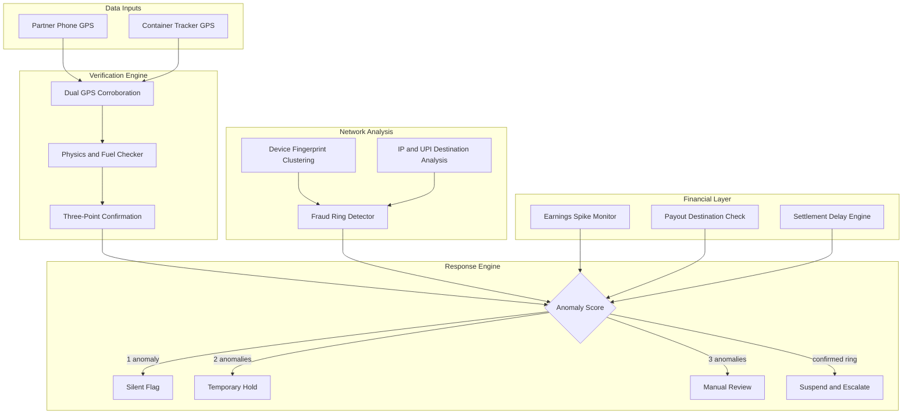
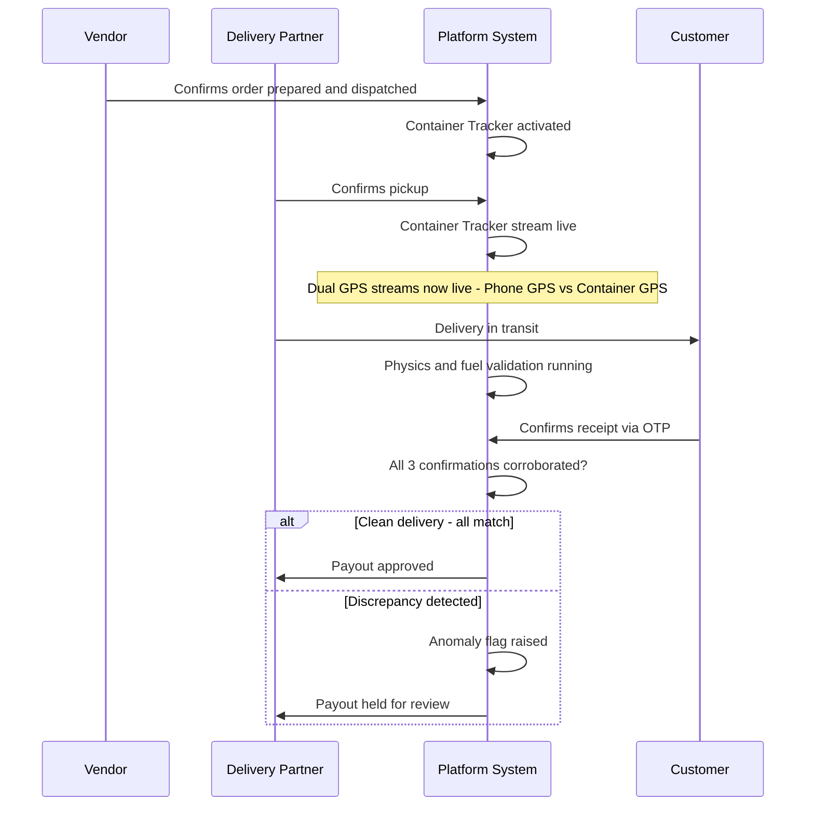
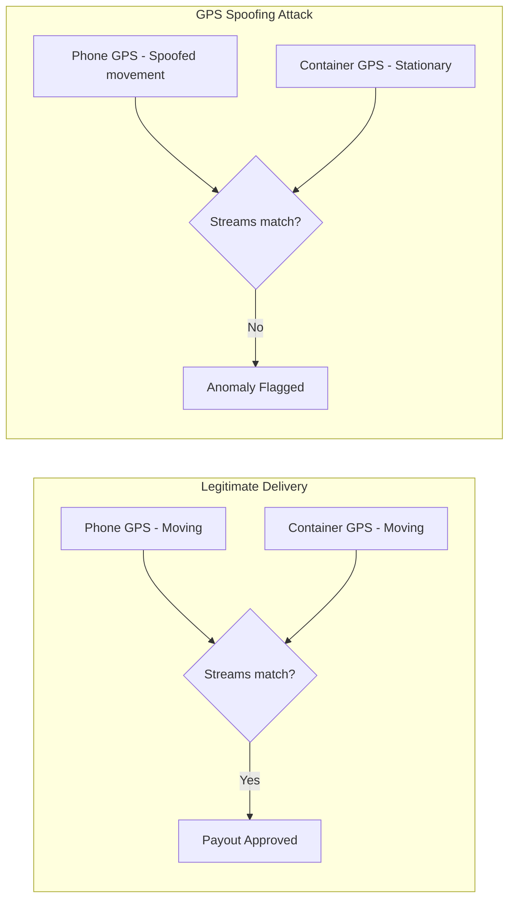
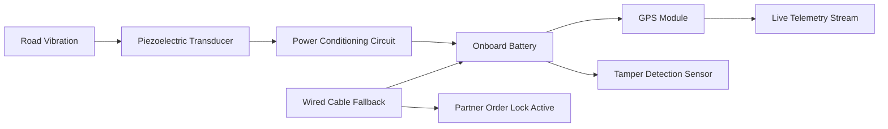
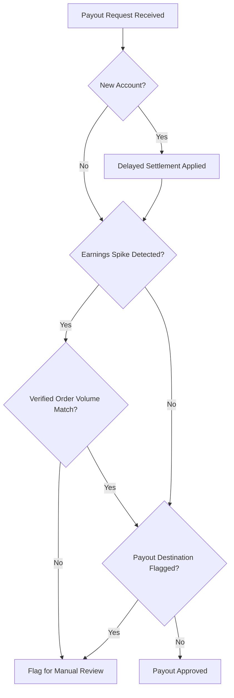
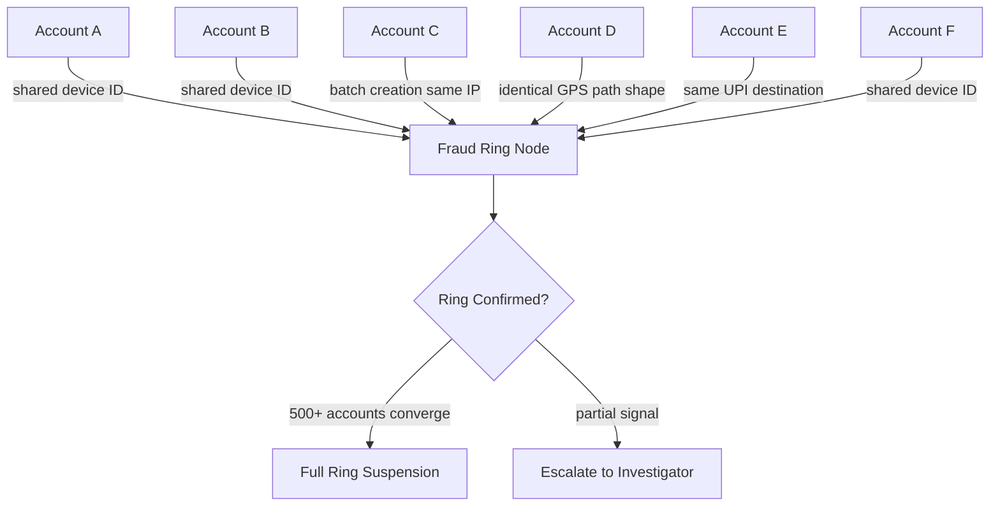
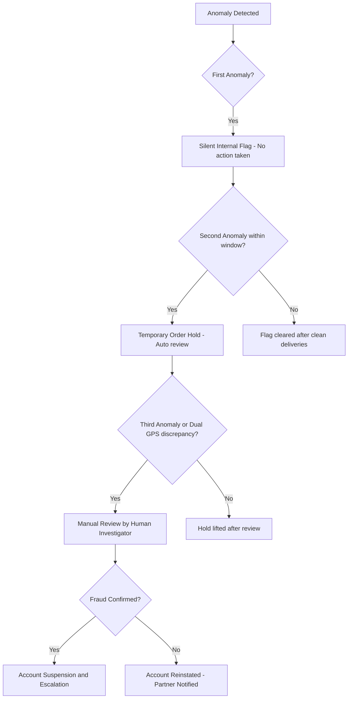

# Vigilant
### Adversarial Fraud Defense for Last-Mile Delivery Platforms

> Built by **CodeZap** for the Market Crash Hackathon Challenge

---

## What Is Vigilant?

Vigilant is a multi-layered fraud detection and prevention infrastructure designed to stop coordinated GPS spoofing, fake delivery rings, and platform payout drain in last-mile delivery operations.

Individual fraudulent transactions are designed to look clean. Vigilant exposes them by cross-referencing hardware telemetry, physics-based delivery validation, and network-level pattern analysis — simultaneously.

---

## The Problem

A coordinated fraud ring of 500 fake accounts — combining fake delivery partners, fake customers, and potentially fake vendors — uses GPS spoofing to simulate deliveries that never happen. Each transaction looks legitimate in isolation. The platform bleeds out through its own payout system.

Traditional fraud detection looks at individual transactions. It misses this entirely.

---

## System Architecture

---

## Threat Model

| Attack Type | Defense Layer | Response |
|---|---|---|
| Partner and Customer Collusion | Three-Point Verification | Requires physical multi-party authentication spanning the full delivery timeline |
| GPS Spoofing via Mock Locations | Dual GPS Stream Corroboration | Detects discrepancy between phone GPS and independent container tracker |
| Hardware Tampering or Disabling | Self-Powered Piezoelectric Tracker | Tracker offline means partner is locked out of accepting orders |
| Liquidity and Payout Drain | Financial Circuit Breakers | Earnings spikes and large payouts held for review |
| Coordinated Fraud Rings | Network-Level Detection | Shared device fingerprints, IP clusters, and UPI destination convergence |
| Phantom and Speed Deliveries | Physics-Based and Fuel Corroboration | Distance and fuel claims validated against timestamp corridors and container movement |

---

## How a Clean Delivery Works End to End

A vendor prepares an order and confirms dispatch on the platform. That confirmation activates the container tracker embedded in the delivery container. The delivery partner arrives and confirms pickup. Two independent GPS streams now run in parallel — the partner's phone and the container tracker — both feeding live data to the verification engine.

During transit, the physics checker continuously validates whether the claimed route and fuel usage are plausible given the distance and real traffic conditions. When the customer confirms receipt via OTP, the system corroborates all three confirmations, cross-references the dual GPS streams, validates the fuel claim against actual container movement, and only then releases the payout.

Every honest delivery passes through this pipeline invisibly. Every fraudulent one surfaces a discrepancy.

---

## Defense Layers In Detail

### 1. Three-Point Verification

Compromising all three confirmation points simultaneously is exponentially harder than compromising one. Partner-customer collusion — the most common attack vector — is neutralized because the vendor confirmation exists independently of both.

---

### 2. Dual GPS Stream Verification

The delivery container carries a tamper-proof GPS tracker that is entirely independent of the delivery partner's phone. Both streams must corroborate each other throughout the delivery.

Spoofing the phone GPS becomes irrelevant. The container tells its own story independently.

---

### 3. Self-Powered Piezoelectric Container Tracker

The container tracker powers itself using piezoelectric transducers that convert mechanical vibration into electricity. Indian road conditions produce near-continuous vibration during transit, making this a reliable and context-specific power source.

A wired charging fallback exists but while the tracker charges via cable, the partner cannot accept new orders. If the tracker goes offline for any reason, the partner is locked out entirely. An honest worker is temporarily inconvenienced. A fraudster who disables the tracker loses their ability to work completely and cannot resolve it legitimately.

---

### 4. Financial Circuit Breakers

Most fraud detection focuses on cash collection. Vigilant protects the platform's outgoing payout side.

Delayed settlements for new accounts, flags for earnings spikes without corresponding verified order volume, and payout destination analysis against known fraud ring UPI IDs and bank accounts.

---

### 5. Network-Level Fraud Ring Detection

Individual fake accounts look clean in isolation. The fraud becomes visible only when accounts are analyzed collectively.

A single suspicious account is a flag. Five hundred accounts sharing the same device ID is a confirmed ring.

---

### 6. Physics-Based Delivery and Fuel Corroboration

Every delivery is checked against physical reality.

- **Fuel Claim Verification** — Fuel allowances are cross-referenced against actual container tracker movement. A stationary tracker combined with a maximum fuel claim is an immediate fraud signal.
- **Map Corroboration** — Both GPS streams must describe the same route. Any divergence is flagged.
- **Distance Plausibility** — The claimed distance must be physically achievable within the time window between vendor dispatch and customer receipt, accounting for real traffic conditions.

---

## Graduated Response — Fairness by Design

No single anomaly triggers a ban. The system responds in graduated steps so honest workers facing genuine technical issues face minimal disruption while bad actors are blocked completely.

At every stage the delivery partner can see their status and understand why a hold has been placed, with a clear path to resolution.

---

## Why This Works at Scale

The hardware tracker is manufactured and leased to delivery platforms on a per-container subscription basis. The unit cost is recovered within weeks through prevented fraud losses alone.

The software verification layer — dual GPS corroboration, physics-based delivery validation, and network-level ring detection — is packaged as a standalone API that any gig economy platform can license. Food delivery today. Ride sharing tomorrow. Any platform that moves goods or people using independent contractors faces this exact problem.

Platforms that adopt Vigilant can be independently certified as fraud-resistant. That certification becomes a signal to investors, insurance providers, and enterprise clients who cannot afford liquidity exposure from coordinated fraud rings.

---

## Business Model

| Stream | Description |
|---|---|
| Hardware Leasing | Self-powered container tracker leased per unit per month |
| Fraud Detection SaaS | Verification API licensed to any gig economy platform |
| Trust Certification | Independent fraud-resistance certification for adopting platforms |

---

## Built With

- Piezoelectric energy harvesting hardware
- Dual GPS telemetry corroboration
- Physics-based delivery and fuel validation engine
- Network-level graph analysis for fraud ring detection
- Financial circuit breaker logic on the payout side

---

## Team

**CodeZap**
Market Crash Hackathon — 2025

---

*Vigilant is infrastructure, not a feature.*